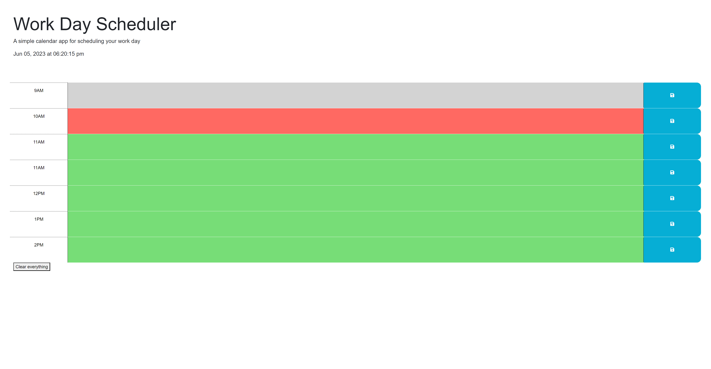

# Weather-Forecast
  
## Description
In challenge five we were asked to create a simple work day scheduling app using starter code. What this website is meant to do is save what you want to do depending on the time and keep it stored onto the page even after you refresh. This will allow you to have an easy visual to remind you of task or errands that you have to do.
1. [Install](#install)
2. [Usage](#usage)
3. [Contribution](#contribution)
4. [License](#license)

## install
N/A

## usage
This calendar will display the time and allow you to save task with a click. At the bottom there is a clear button to clear everything you had.
Click the link to access the work day scheduler:  https://marvinblunck.github.io/weather-forcast/

Type in anything into the hours listed 

This is the preview of the page:

## contribution
Used mini project 5 from our class repo.

This youtube video helped me a lot with lcoal storage https://youtu.be/G0jO8kUrg-I

## license
MIT